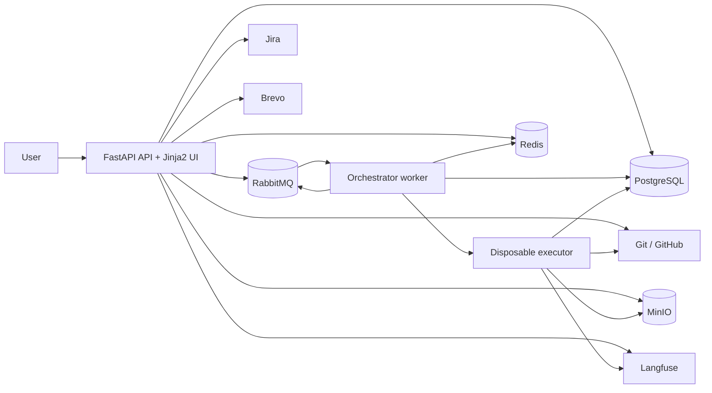
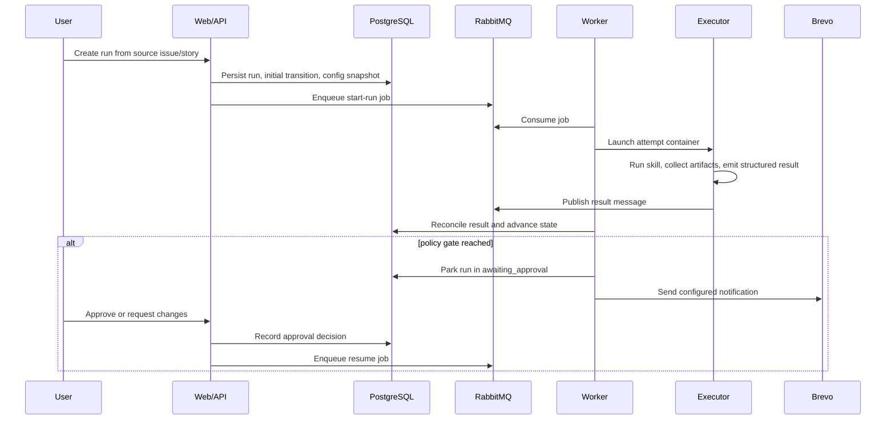
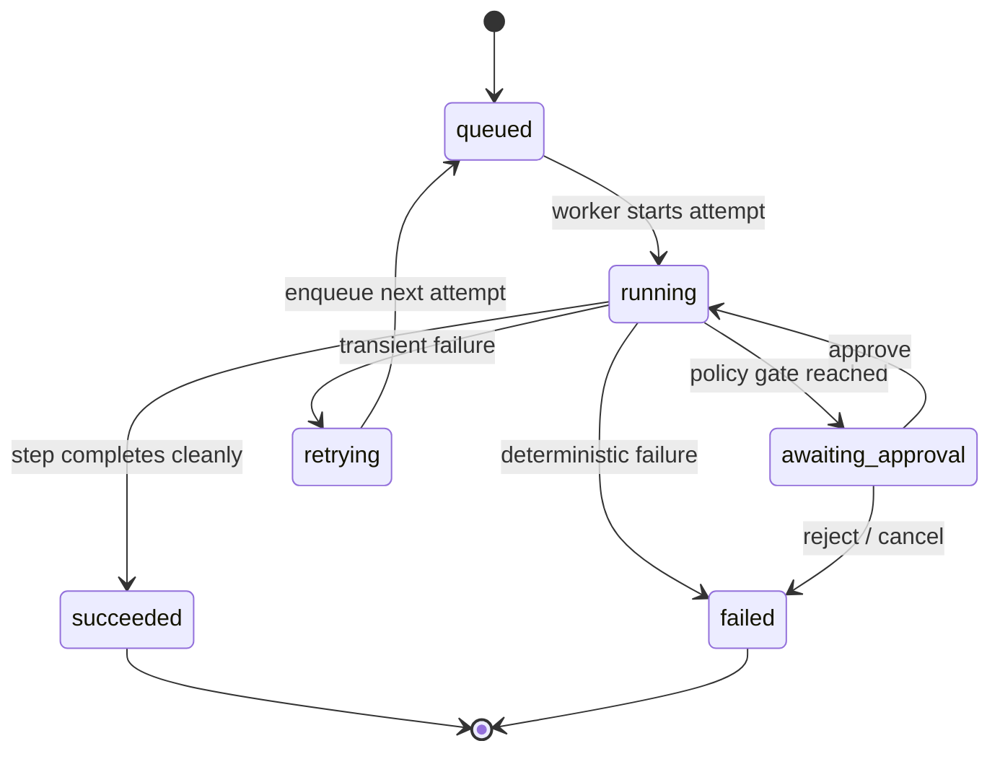
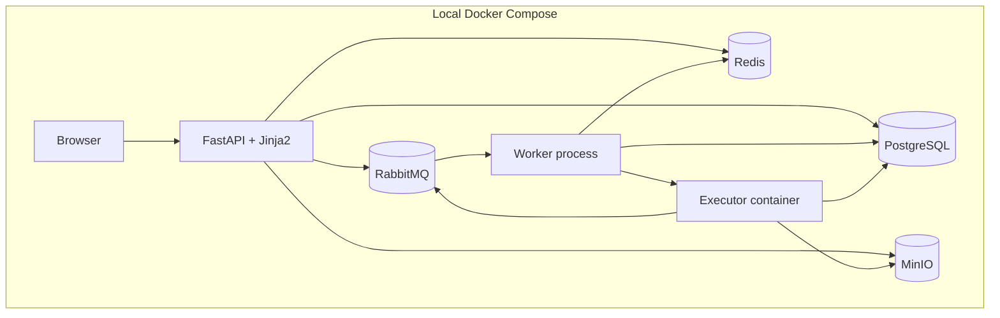

# Architecture

**Status:** Approved · **Date:** 2026-07-10

## Overview

BheemBhai is a governed workflow orchestration platform for reusable agent skills. The MVP is a
story-to-PR SDLC engine that runs backend-owned workflows, pauses for policy-gated review, resumes
after approval, and leaves a durable audit trail of every transition and cost-bearing action.

The agreed shape is a modular monolith with separate API, worker, and executor processes. The API
handles auth, project setup, configuration, run creation, approvals, and read views. The worker
drives workflow progression, launches isolated step attempts, reconciles results, retries transient
failures, and resumes parked runs. The executor container performs one attempt at a time and
publishes a structured result. RabbitMQ carries jobs and result messages, PostgreSQL is the source
of truth, Redis holds leases and ephemeral coordination state, MinIO stores encrypted secret blobs,
and Git and GitHub persist artifacts and PR outputs.

## Diagrams

### Component diagram

### Sequence diagram

### State diagram

### Deployment / topology diagram

## Components

| Component | Responsibility | Talks to | Tech |
|-----------|----------------|----------|------|
| Web/API app | Auth, project setup, integrations, workflow-policy selection, run creation, approvals, dashboards | PostgreSQL, RabbitMQ, Redis, MinIO, GitHub, Jira, Brevo, Langfuse | FastAPI, Jinja2, Bootstrap |
| Orchestrator worker | Consume jobs, launch attempts, reconcile outcomes, retry transient failures, resume parked runs | RabbitMQ, PostgreSQL, Redis, Docker runtime, GitHub, Jira, LiteLLM, Langfuse | Python worker process |
| Executor container | Execute one step attempt, call the agent runner, emit structured result and artifact refs, exit | Git checkout, LiteLLM, result queue, MinIO, GitHub | Disposable Docker container |
| Secure storage adapter | Encrypt provider secrets before writing them to MinIO and decrypt them on read | MinIO, cryptography, environment key material | Python adapter |
| RabbitMQ broker | Durable job and result transport | API, worker, executor | RabbitMQ 4.3.2 |
| PostgreSQL | System of record for users, projects, workflows, policies, runs, steps, attempts, approvals, transitions, and notification history | API, worker | PostgreSQL 18.4 |
| Watcher loop | Observe runtime exit state and consume result messages | RabbitMQ, Redis, PostgreSQL | Python worker loop |
| Reconciler | Classify outcomes, decide retries, and queue the next action | PostgreSQL, RabbitMQ, Redis | Python worker loop |
| Redis | Leases, heartbeats, ephemeral locks, and coordination metadata | Worker, watcher, reconciler | Redis OSS 8.8 |
| MinIO | Secure blob store for credentials and sensitive runtime payloads | API, worker, executor | MinIO |
| Git/GitHub | Artifact persistence and PR creation | Worker, executor, GitHub API | git CLI, GitHub |
| Jira adapter | Project-management tool linkage and source issue reference validation | API, worker | Atlassian Jira integration |
| LiteLLM proxy | Mandatory model proxy and cost metering seam | Executor, worker | LiteLLM 1.91.1 |
| Brevo email plugin | Transactional email delivery for notifications | API, worker | brevo-python 5.0.1 |
| Langfuse | Tracing and run/step observability | API, worker, executor | Langfuse v3 |

## Data flow

1. A user signs in through the API, which establishes a server session and loads their project-scoped memberships.
2. An admin creates or edits a project, linking GitHub and Jira providers and selecting active integration providers for the project.
3. The admin binds a versioned workflow and policy to the project and selects the notification configuration.
4. A run is created from a source issue key and free-form starting story input. The API pins the workflow version, policy version, notification config version, recipient snapshot, and source issue reference, then records an initial transition and enqueues a `start-run` job.
5. The worker consumes the job from RabbitMQ, resolves the selected workflow and policy, and launches a disposable executor container with the run, step, attempt, repository, and secret context it needs.
6. The executor checks out the repository at the pinned commit, runs the agent skill, routes LLM calls through LiteLLM, writes artifacts to Git and/or object storage, publishes the structured result message to RabbitMQ, and exits.
7. The worker reconciles the result message with runtime status and lease state. A clean success advances to the next step. A policy gate parks the run in `awaiting_approval`. A transient failure retries with a new attempt. A deterministic failure escalates.
8. If a reviewer chooses `approve`, the worker resumes the parked run. If the reviewer chooses `request_changes`, the workflow routes back to the immediately previous step and creates a new attempt for that step while preserving the review record and the old attempt history.
9. The worker appends every state transition to the audit log, rolls up cost, and dispatches notifications according to the project notification configuration and run-time recipient snapshot.

## Cross-cutting concerns

- Authentication is local email/password with email verification and reset flows. Sessions are server-side and project role checks gate every privileged action.
- Authorization is split into a platform admin flag and project-scoped membership roles. Project roles drive who can create runs, approve gates, and administer integrations.
- Secrets are never written to logs, result payloads, or generated artifacts. Integration credentials are retrieved from secure storage only when an attempt starts.
- Secrets are encrypted in the application before they are persisted to MinIO and decrypted only
  when the secure-storage adapter reads them back. MinIO stores the encrypted ciphertext, not the
  cleartext secret.
- All logs and traces carry the run and attempt correlation identifiers so the API, worker, executor, and observability backend can be joined during debugging.
- The append-only state-transition log is the audit spine. Current state columns exist on run, step, and attempt rows for fast reads, but the log is the immutable history.
- Email notifications are based on the project notification configuration captured when the run starts, not on mutable live settings.
- Configuration is environment-driven, with secrets supplied via environment variables and secure storage references. No integration key is hard-coded.

## Non-functional design

| NFR | Mechanism |
|-----|-----------|
| NFR-001 | The API persists run and step state before enqueueing the next job. |
| NFR-002 | The reconciler uses runtime status plus result transport, so container death is detected externally. |
| NFR-003 | Runs are resumable from durable DB state and do not depend on the previous container still existing. |
| NFR-004 | Secrets are encrypted in the application, stored in MinIO as ciphertext, and injected only at runtime; logging redaction is mandatory. |
| NFR-005 | Each attempt runs in a disposable container with isolated filesystem and process boundaries. |
| NFR-006 | Secret access is scoped to the project and the attempt's required action. |
| NFR-007 | State-transition rows are append-only and normal user flows do not modify them. |
| NFR-008 | Every log, trace, and state row includes a correlation identifier. |
| NFR-009 | Run creation returns immediately after persistence and enqueueing. |
| NFR-010 | Dashboard reads use current-state columns and indexed transitions for sub-2-second loads at MVP scale. |
| NFR-011 | Workflow, policy, notification, integration, runner, proxy, email, and runtime are separate configuration concerns. |
| NFR-012 | The runtime interface is abstracted behind one worker contract, so local Docker can later become remote Docker or Kubernetes without domain changes. |
| NFR-013 | Approval and state-transition history remain queryable and immutable for audit reconstruction. |
| NFR-014 | The UI conventions require semantic HTML, keyboard support, labels, and contrast-safe theme usage. |
| NFR-015 | The worker is stateless aside from DB and broker state, so more workers can be added later. |
| NFR-016 | Tenant isolation is deliberately not implemented in the MVP, but data model boundaries preserve a future tenant key seam. |

## Seams for later

- Swap local Docker for remote Docker or Kubernetes without changing workflow logic.
- Add more agent runners behind the same runner contract.
- Add more model providers behind LiteLLM without changing the application code.
- Add Jira and Azure DevOps beyond the first supported integrations.
- Add quorum approvals and richer notification channels after the single-reviewer model proves itself.
- Add tenant-scoped data partitioning and budgeting when the product moves beyond internal MVP use.

## Traceability

| Component or concern | PRD coverage |
|----------------------|--------------|
| Web/API app | FR-001 to FR-006, FR-021 to FR-026, FR-027 to FR-048, FR-049 to FR-055 |
| Orchestrator worker | FR-027 to FR-040, FR-043 to FR-055, NFR-001 to NFR-003, NFR-009, NFR-012, NFR-015 |
| Executor container | FR-035 to FR-042, NFR-002, NFR-004, NFR-005, NFR-006 |
| RabbitMQ broker | FR-027, FR-029, FR-033, FR-037, FR-039, NFR-009 |
| PostgreSQL | FR-001 to FR-006, FR-021 to FR-055, NFR-007, NFR-008, NFR-010, NFR-013 |
| Redis | NFR-002, NFR-003, NFR-012, NFR-015 |
| MinIO | FR-009, FR-010, NFR-004, NFR-006 |
| Git/GitHub | FR-001, FR-012, FR-038, FR-049, FR-051 |
| Jira adapter | FR-001, FR-004, FR-011, FR-017, FR-020 |
| Brevo plugin | FR-016, FR-019, FR-048 |
| LiteLLM | FR-014, FR-052, FR-053, FR-054 |
| Langfuse | FR-015, FR-055, NFR-008 |
